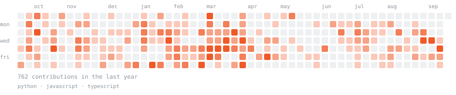

<samp>

## ahtisham dilawar

ai / backend engineer in pakistan. i build agents for systems that touch money, and i care about the boring parts: state, auth, the number being right.

currently at [defa by invoicemate](https://defa.invoicemate.net/), building an llm risk agent that reviews payment providers before money moves.

[ahtishamdilawar.me](https://ahtishamdilawar.me) · [linkedin](https://www.linkedin.com/in/ahtisham-dilawar) · [email](mailto:ahtishamdilawar@gmail.com)

</samp>

